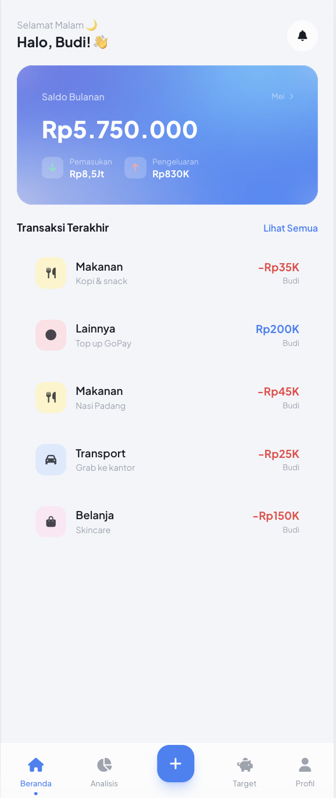
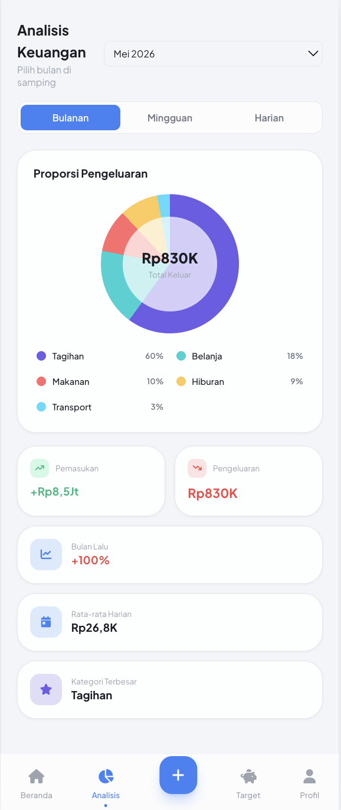
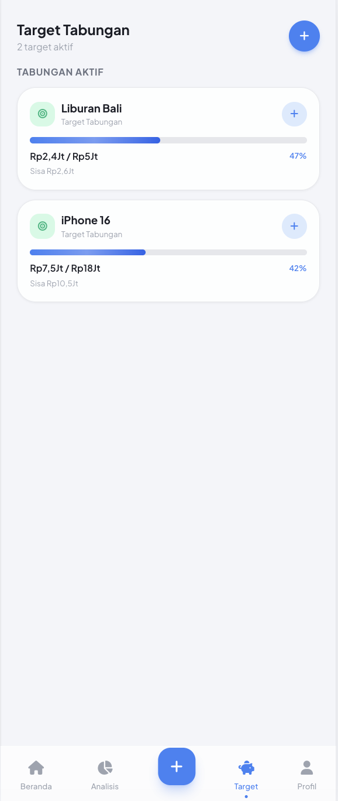
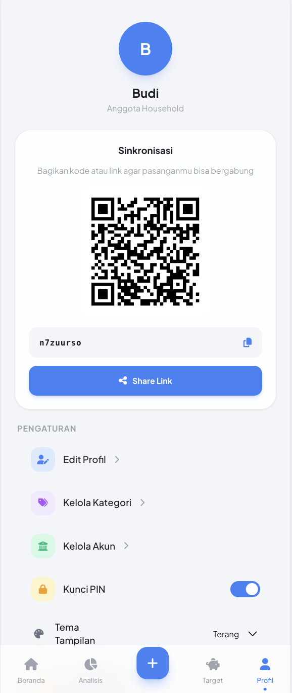
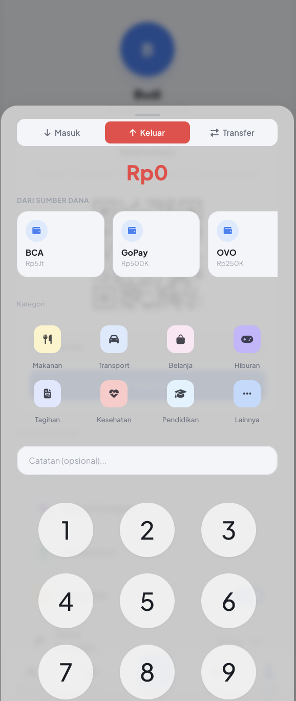

# FundMate 📊

FundMate adalah aplikasi web pencatat keuangan cerdas yang didesain untuk membantu individu dan pasangan (Household) melacak pengeluaran harian, menganalisis arus kas bulanan, dan mencapai target tabungan bersama secara *real-time*.

## 📸 Tangkapan Layar (Screenshots)

Berikut adalah antarmuka aplikasi FundMate:

<div align="center">
  
  
  
  
  
</div>

## ✨ Fitur Utama
* **Kolaborasi Household (Real-time):** Sinkronisasi data keuangan seketika menggunakan Cloud Firebase. Undang pasangan Anda hanya dengan membagikan sebuah tautan rahasia.
* **Progressive Web App (PWA):** Dapat diinstal langsung ke Layar Utama *smartphone* Android (Chrome) maupun iPhone (Safari) tanpa perlu mengunduh melalui App Store atau Play Store.
* **Analisis Cerdas & Visualisasi:** Pantau grafik arus kas dan kategori pengeluaran terbesar per bulan.
* **Tabungan Target (Goals):** Buat tujuan finansial dan pantau progres dana yang terkumpul.
* **Tema Mode Gelap (Dark Mode):** Desain adaptif nan elegan yang bersahabat untuk mata, dengan dukungan mode terang, gelap, atau mengikuti pengaturan sistem secara otomatis.
* **Kemanan Privasi PIN:** Lindungi data keuangan Anda dan pasangan dengan PIN 6-digit.

## 🛠️ Teknologi yang Digunakan
FundMate dibangun murni menggunakan teknologi web modern berkinerja tinggi:
* **Frontend:** HTML5, Alpine.js (Reaktivitas UI), Tailwind CSS (Desain dan styling via CDN).
* **Backend / Database:** Firebase Firestore (NoSQL) untuk penyimpanan *real-time*.
* **Ikonografi:** FontAwesome v6.

## 🚀 Instalasi & Cara Menjalankan Lokal

Jika Anda ingin menjalankan atau mengembangkan aplikasi ini di komputer Anda sendiri:

1. **Clone Repositori Ini**
   ```bash
   git clone https://github.com/septianadi27/fundmate-app.git
   cd fundmate-app
   ```
2. **Konfigurasi Firebase**
   - Buka file `js/firebase.js` (jika Anda ingin menggunakan database Anda sendiri).
   - Ganti `firebaseConfig` dengan detail konfigurasi Firebase Project Anda.
3. **Jalankan Aplikasi**
   - Karena aplikasi ini berbasis HTML murni, Anda bisa membukanya langsung menggunakan ekstensi *Live Server* di VSCode, atau menempatkannya di direktori `htdocs` XAMPP Anda.
   - Buka peramban dan akses: `http://localhost/fundmate` (sesuaikan dengan nama folder).

## 💡 Instalasi Aplikasi (PWA) di Smartphone
Aplikasi ini sudah mendukung *Progressive Web App*. Akses situs yang telah di-*hosting* (misal via Vercel) dari peramban HP Anda:
- **Android (Chrome):** Ketuk menu titik tiga -> "Install Aplikasi".
- **iOS (Safari):** Ketuk tombol Bagikan (Share) -> "Tambah ke Layar Utama".

---

Dibuat dengan ❤️ oleh **[Septian Adi](https://github.com/septianadi27)**.
